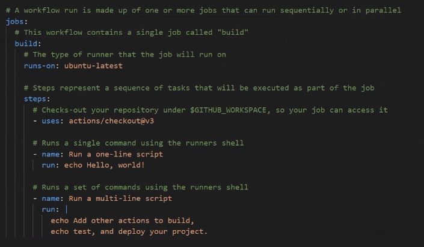
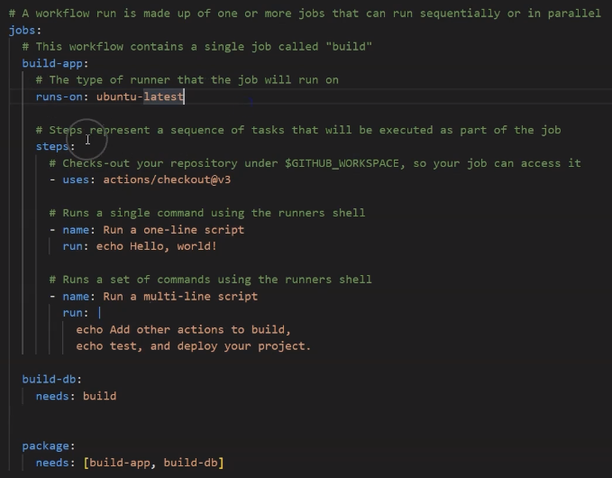
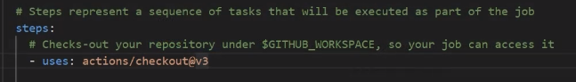

# Job
Job is a set of steps in a workflow that executes on the same runner. Each step is either a script that will be 
executed or an action that will run. Steps are executed in order and are dependent on each other. We can transfer 
data between steps because each one is carried out on the same runner machine. 

## job dependency
By default, jobs have no dependencies and run in parallel with each other but we can configure a job's dependency 
with other job. When a job's dependency is defined, it will wait for the dependent job to complete before it can run. 

To define a dependency you use ***needs:*** tag under your job as shown in the example bellow.

A workflow run is made up of one or more jobs which run in parallel. By default a simple runner is a server that runs 
your workflows when they are triggered, each runner can run a single job at a time. GitHub provides Ubuntu, Linux, 
Microsoft Windows and macOS runners to run your workflows. Please note each workflow run executes in a fresh newly 
provisioned virtual machine. If you need a different operating system or require a specific hardware configuration, 
you can host your own runner machine called as self hosted runner.

## actions
As we know, a job contains a sequence of tasks called steps, and each step is either an action that will run or a 
script that will execute inside the boundary of a job. An action is a custom application for the GitHub action platform
that performs a complex but frequently repeated tasks. Use an action to reduce the amount of repetitive code that you 
write in your workflow files.

Few example of what an action can do an action can pull your Git repository from GitHub, set up the correct tool chain 
for your build environment, or set up the authentication to your cloud provider. You can write your own actions or you 
can find actions to use in your workflows in the GitHub marketplace.
