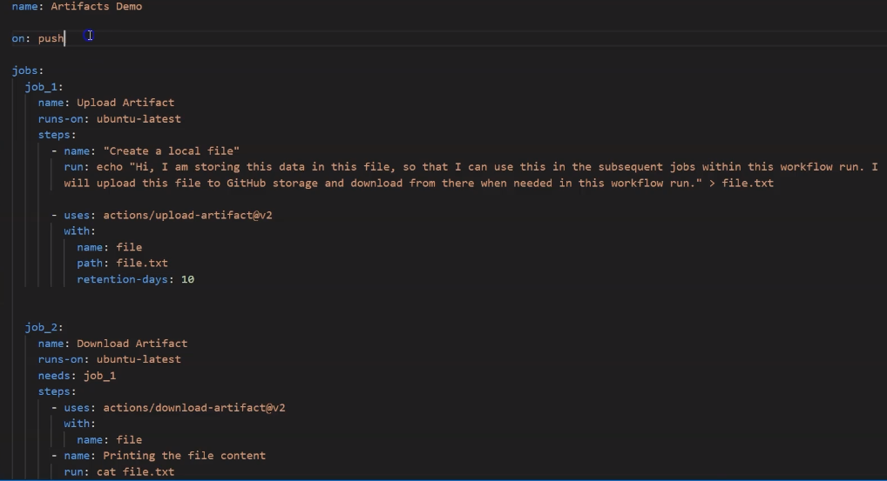

# Artifacts
Artifacts allow us to persist data after a job has completed and share the data with another job in the same workflow. 
An artifact is a file or collection of files produced during a workflow run. For example, we can use artifacts to save 
our build or test output. After a work flow run has ended, we can build the code in one place, store the package as an 
artifact, and use this package in the subsequent deploy jobs by downloading the artifact. 

GitHub stores build logs and artifacts for 90 days and this retention period can be customized by specifying a value 
for ***retention-days****:

