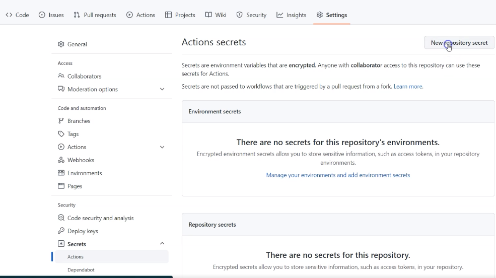
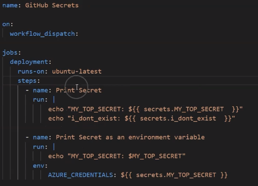
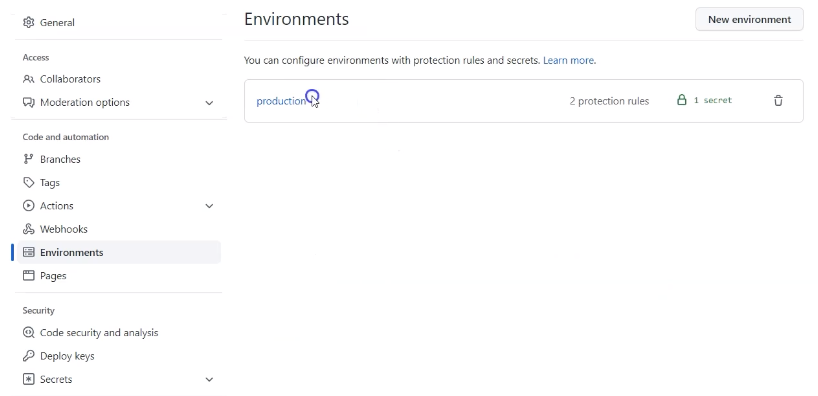
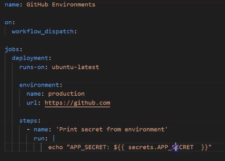

# Secrets
You can store your actions secrets for example to access AWS under setup/secrets/actions as shown in the image.

After you store the secret, it will be encrypted, and you will not be able to see it. The github job will decrypt the 
secret and get its value when it runs the workflow.
If you want to update the scret yaou can do that, but you can not view the exiting value.

## Environment secrets
When we have production, testing, staging and etc, it will be confusing to put our secrets related to an 
environment under secret actions. To solve that we can create environment and put our secrets in it.

if the secret is not defined in the environment it will get it from the repository secrets.

