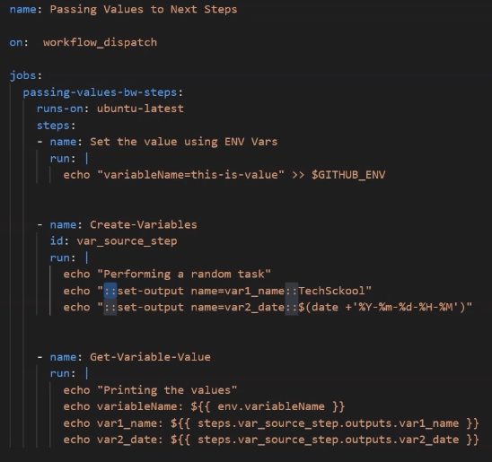
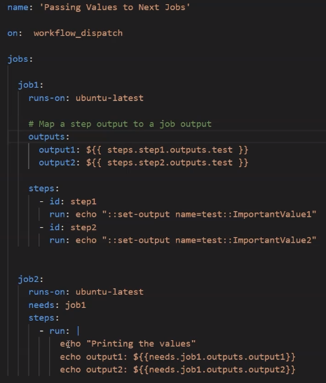

# Sharing values between steps and jobs

## share values between steps
we can share values by writing to ***GITHUB_ENV*** or using ***::set-output***

Notice from the image above, inorder to use ***::set-output*** you must spectiy and ***id*** to the step.

## share values between jobs

