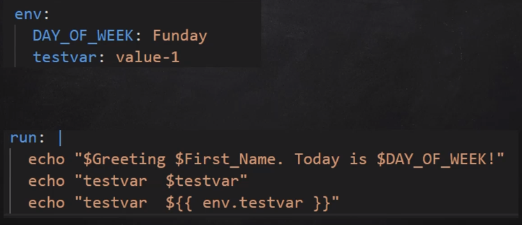
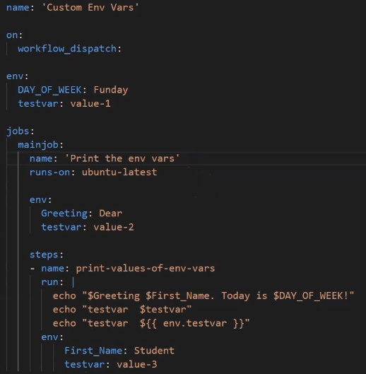
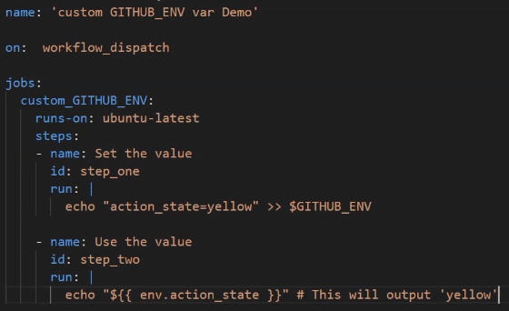

# Variables
Variables are used to store information to be referenced and manipulated in a program. It is a value that can change 
depending on conditions or on information passed to the program. We create a variable and assign a value to it with 
intention to use them one or more times later in the workflow.

[github variables documentation](https://docs.github.com/en/actions/learn-github-actions/variables)

## Environment variables
When it comes to GitHub action workflow, we can use environment variables to store information that we want to 
reference later inside workflow. We reference environment variables within a workflow step or an action and the 
variables are interpolated on the runner machine that runs our workflow. Commands that run in actions or workflow 
steps can create, read and modify environment variables. 

The scope of a custom environment variable is limited to the element in which it is defined.

In The example the DAY:OF_WEEK and testvar will be scoped all over the document. Greeting will be scoped just on 
the main job, while testvar will be

### GitHUB_ENV
The GitHUB_ENV represents the environment variables for a workflow, we can use it to set and get env variables

## Default variables
[Default environment variables documentation](https://docs.github.com/en/actions/learn-github-actions/variables#default-environment-variables)

default environment variables that GitHub sets automatically.

